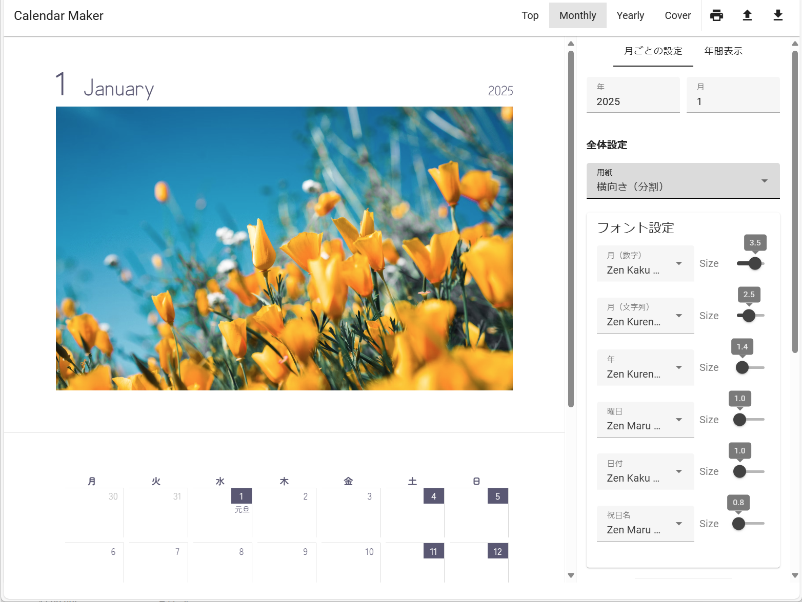
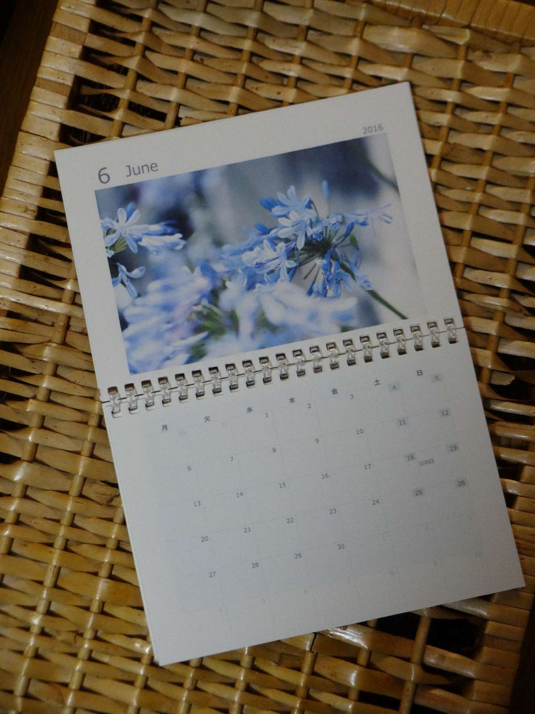

# Calendar Maker


[動作環境](https://calendar-maker.satocheeen.com/)

## Overview
オリジナルのカレンダーを作成するためのシステムです。


個人的に毎年、A5サイズのカレンダー兼用の手帳を自作しているため、システム化した経緯です。
（以前はExcel駆使して作ってた）



## Setup

```bash
npm install
npm run dev
```

